<p align="center">
  
</p>

<p align="center">
  
  
  
  <a href="https://www.python.org/downloads/"></a>
  <a href="https://modelcontextprotocol.io/"></a>
  <a href="https://github.com/ry-ops/unifi-mcp-server/releases"></a>
  <a href="LICENSE"></a>
</p>

<p align="center"><b>Ask your UniFi network anything.</b> An MCP server that gives Claude, or any MCP client, the whole UniFi Network API, every one of its 73 calls, through UniFi's cloud at <code>api.ui.com</code>. One API key from unifi.ui.com, no VPN, no console IP.</p>

<p align="center">
  <a href="#what">What it does</a> ·
  <a href="#toolbox">Toolbox</a> ·
  <a href="#setup">Setup</a> ·
  <a href="#safety">Safety</a> ·
  <a href="#updating">New API versions</a> ·
  <a href="#layout">Layout</a> ·
  <a href="#a2a">A2A</a> ·
  <a href="#troubleshooting">Troubleshooting</a>
</p>

---

<a id="what"></a>

## ✨ What it does

- 🌐 **Covers the whole Network API.** One tool for each of the 73 operations in the UniFi Network API v10.6.106: devices, clients, networks, Wi-Fi, firewall zones and policies, ACL rules, DNS policies, traffic matching lists, hotspot vouchers, switching, VPN and WAN.
- ☁️ **Works from anywhere.** Every call goes to `api.ui.com` with your API key and reaches the console through UniFi's cloud connector. The server finds your console and site by itself.
- 🛰️ **Sees your whole account.** 9 Site Manager tools list your consoles, sites and devices, ISP metrics, and SD-WAN configs.
- 🔎 **Has shortcuts for common questions.** `get_site_status` sums up a site in one call, `search_site` finds a client or device by name, MAC or IP, and `describe_operation` returns the exact request schema before a create or update.
- 🛡️ **Knows what's risky.** Every tool is marked read-only, write or destructive, and `UNIFI_READ_ONLY=true` turns off everything that could change your network.

**Ask things like:**

> *"Is anything on my network offline?"*
> *"Which clients are wired right now?"*
> *"Power-cycle port 7 on the office switch."*
> *"Make 10 guest Wi-Fi vouchers that last a day."*
> *"Block the Hotspot zone from reaching the Internal zone, then show me where the rule landed."*
> *"How was my ISP's latency over the last day?"*

<a id="toolbox"></a>

## 🧰 The toolbox

<p align="center">
  
</p>

| Group | Tools |
|---|---|
| **Helpers** (5) | `unifi_health`, `get_site_status`, `search_site`, `list_operations`, `describe_operation` |
| **Network API** (73) | Every operation in the spec, named after it: `list_adopted_devices`, `execute_port_action`, `list_connected_clients`, `create_network`, `update_wifi_broadcast`, `create_firewall_policy`, `reorder_user_defined_acl_rules`, `generate_vouchers`, `list_wan_interfaces`, … |
| **Site Manager** (9) | `cloud_list_hosts`, `cloud_get_host_by_id`, `cloud_list_sites`, `cloud_list_devices`, `cloud_get_isp_metrics`, `cloud_query_isp_metrics`, `cloud_list_sd_wan_configs`, `cloud_get_sd_wan_config_by_id`, `cloud_get_sd_wan_config_status` |

The full list, with each tool's HTTP call and whether it changes anything, is in [docs/commands.md](docs/commands.md). It's generated from the specs, so it always matches the code.

**List tools** take `offset`, `limit` and a `filter` (for example `state.eq('ONLINE')` or `and(type.eq('WIRED'),name.like('pve*'))`), plus `all_pages=true` to fetch everything. **`site_id` is optional** everywhere; leave it out to use the default site.

**Resources** (read-only, by URI): `unifi://health`, `unifi://sites/{site_id}/devices`, `unifi://sites/{site_id}/clients`.

**Prompt playbooks:** `check_unifi_health`, `restart_device`, `change_firewall_safely`, `guest_access`.

<a id="setup"></a>

## 🚀 Setup

You need **Python 3.12+** with [`uv`](https://github.com/astral-sh/uv), and a UniFi console with remote management turned on and linked to your UniFi account.

**1. Get an API key.** At [unifi.ui.com](https://unifi.ui.com), go to **Settings → API Keys** and choose **Create New API Key**. Use the account that owns the console: a key from another account sees no consoles.

**2. Install**

```bash
git clone https://github.com/ry-ops/unifi-mcp-server && cd unifi-mcp-server
uv sync
cp secrets.env.example secrets.env
```

**3. Configure.** Put your key in `secrets.env`, which is git-ignored. Environment variables work too, and win over the file.

```bash
UNIFI_API_KEY=your_api_key

# Optional
UNIFI_CONSOLE_ID=   # only needed if your account has more than one console
UNIFI_SITE_ID=      # only needed if the console has several sites and none is "default"
UNIFI_READ_ONLY=false
UNIFI_TIMEOUT_S=30
```

**4. Check it**

```bash
uv run mcp dev main.py   # MCP Inspector: run unifi_health
```

**5. Connect your MCP client.** For Claude Code:

```bash
claude mcp add unifi -- uv run --directory /absolute/path/to/unifi-mcp-server python main.py
```

For Claude Desktop, add this to `claude_desktop_config.json`:

```json
{
  "mcpServers": {
    "unifi": {
      "command": "uv",
      "args": ["run", "--directory", "/absolute/path/to/unifi-mcp-server", "python", "main.py"]
    }
  }
}
```

<a id="safety"></a>

## 🔒 Safety

- **32 tools can change your network.** 9 create things (networks, Wi-Fi, firewall zones and policies, ACL rules, DNS policies, traffic matching lists, vouchers) or adopt devices. 23 delete, replace or restart things. The **playbooks** tell the AI to read first, fetch the schema, and confirm with you. The **tools themselves don't enforce confirmation**, so keep your MCP client's tool approval on.
- **Every tool carries MCP hints** (`readOnlyHint`, `destructiveHint`, `idempotentHint`), so clients that respect them can auto-approve reads and stop on the rest.
- **`UNIFI_READ_ONLY=true`** registers only the 55 tools that can't change anything.
- **Requests only go to `api.ui.com`.** The server refuses any other host, and it encodes path values and rejects ones like `..` or `a/b`, so a crafted ID can't reach a different path behind the cloud connector.
- **Never commit real keys.** `secrets.env` is git-ignored; the tracked template is `secrets.env.example`.

<a id="updating"></a>

## 🔄 When UniFi ships a new API version

The tools are generated from the OpenAPI specs in [`specs/`](specs), copied unchanged from [developer.ui.com](https://developer.ui.com/llms.txt).

1. Download the new `openapi.json` into `specs/` and point `SPECS` in [`scripts/generate_tools.py`](scripts/generate_tools.py) at it.
2. Run `python3 scripts/generate_tools.py`. It rewrites `unifi_mcp/tools.py` and `docs/commands.md`.
3. Run `uv run python -m unittest discover -s tests`. The tests fail if any operation in the spec lacks a tool or a tool sends the wrong request.

CI runs the same tests and checks that the generated files match the specs.

<a id="layout"></a>

## 📁 Project layout

| Path | What's in it |
|---|---|
| `main.py` | The MCP server: registers the tools, helpers, resources and playbooks |
| `unifi_mcp/client.py` | HTTP client for `api.ui.com`: auth, console and site discovery, pagination, path checks |
| `unifi_mcp/tools.py` | One function per API operation, **generated**; don't edit by hand |
| `specs/` | The OpenAPI specs the tools are generated from |
| `scripts/generate_tools.py` | Generates `unifi_mcp/tools.py` and `docs/commands.md` from `specs/` |
| `tests/` | Offline tests, no network or key needed |
| `docs/` | Command reference, playbook, troubleshooting, roadmap, agent card, images |

<a id="a2a"></a>

## 🤝 Agent-to-agent (A2A)

[`docs/agent-card.json`](docs/agent-card.json) describes this server to other agents: 9 skills (site health, devices, clients, networks and Wi-Fi, security policy, hotspot, switching and reference data, the cloud account, and API discovery), the tools and playbooks behind each, how to authenticate, and which tools need confirmation.

<a id="troubleshooting"></a>

## 🩺 Troubleshooting

<details>
<summary><b>Start with <code>unifi_health</code></b></summary>

It lists the consoles your key can see, the console and site the server picked, and the Network application version, or the exact error.
</details>

<details>
<summary><b>"No consoles on this UniFi account"</b></summary>

The key works but belongs to an account that doesn't own the console. Create the key while signed in as the console's owner, and check that remote management is on in the console's settings.
</details>

<details>
<summary><b>"Several consoles found" or "Several sites found"</b></summary>

Set `UNIFI_CONSOLE_ID` or `UNIFI_SITE_ID` to one of the IDs in the message, or pass `site_id` to a tool.
</details>

<details>
<summary><b>401 Unauthorized</b></summary>

The key is wrong, revoked, or has a stray space. Make a new one at unifi.ui.com.
</details>

<details>
<summary><b>400 on a create or update</b></summary>

Call `describe_operation` with the tool's name to get the full body schema, including required fields, allowed values and the fields of each variant. [Troubleshooting](docs/troubleshooting.md#400-on-a-create-or-update) lists rules the console enforces that the spec doesn't mention.
</details>

<details>
<summary><b>The MCP client can't connect</b></summary>

Run `uv run python main.py` in a terminal. The server logs to stderr and stays quiet on stdout, which carries the MCP protocol, so any stray output there is a bug.
</details>

There's more in [docs/troubleshooting.md](docs/troubleshooting.md) and [docs/network-playbook.md](docs/network-playbook.md).

## 🗺️ Roadmap

What's done and what's next is in [docs/roadmap.md](docs/roadmap.md). Release notes are on the [releases page](https://github.com/ry-ops/unifi-mcp-server/releases).

## 🙏 Credits

This project started as a fork of [**zcking/mcp-server-unifi**](https://github.com/zcking/mcp-server-unifi) by Zachary King. Version 2.0 rebuilt it around the cloud connector and the full Network API. MIT licensed. See [LICENSE](LICENSE).

<!-- org-footer -->
---

<p align="center"><sub>Part of <a href="https://github.com/ry-ops">ry-ops</a> · building the pipes between infrastructure, automation, and observability · built by <a href="https://github.com/ry-ops">ry-ops</a></sub></p>
